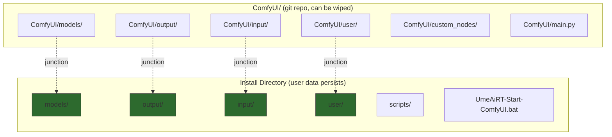
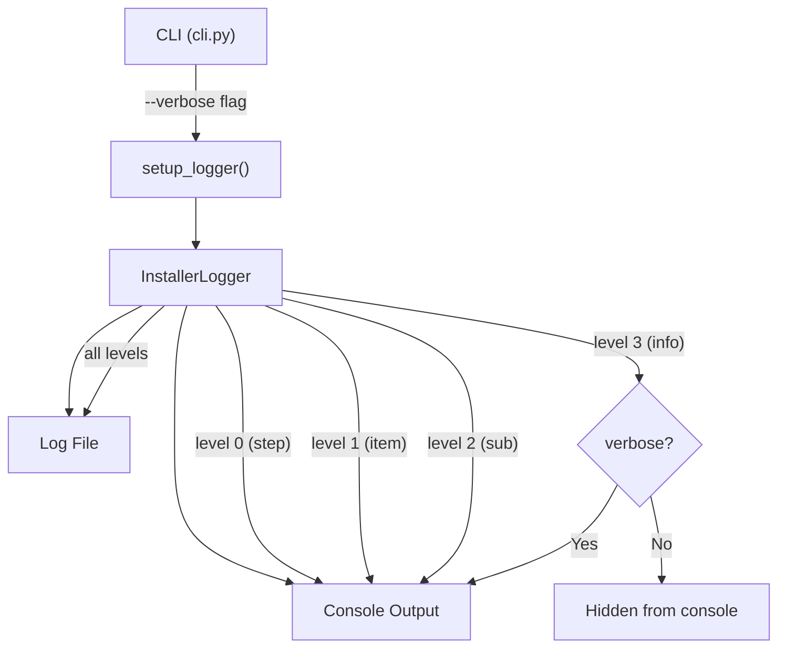
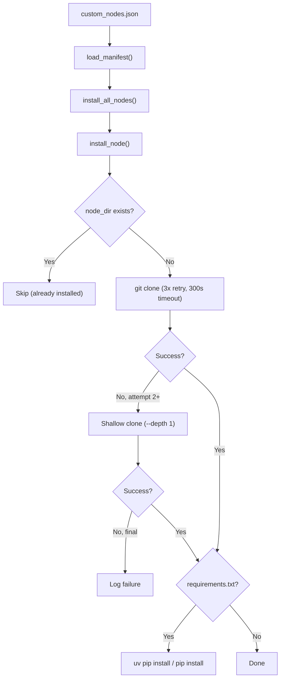

# Architecture Map

## Junction-Based Architecture

The installer separates user data from ComfyUI core to allow clean `git pull` updates.



## Configuration Data Flow

```mermaid
graph LR
    DJ["dependencies.json"] -->|Pydantic| DC["DependenciesConfig"]
    DC -->|repos| P2["phase2.py"]
    DC -->|pip_packages| P2
    DC -->|tools| P1["phase1.py"]
    DC -->|files| P2

    CNJ["custom_nodes.json"] -->|Pydantic| NM["NodeManifest"]
    NM -->|nodes| NO["nodes.py"]
    NO -->|install_node()| CN["custom_nodes/"]
    NO -->|update_node()| CN
```

## Logging Architecture



## Custom Node Installation Flow



## Triton/SageAttention Compatibility

Version constraints based on PyTorch version (logic in `phase2.py`):

| PyTorch | triton-windows | Notes |
|---------|----------------|-------|
| 2.7.x | `==3.2.0` | Oldest supported |
| 2.8.x | `>=3.2.0,<3.4.0` | |
| 2.9.x | `>=3.3.0,<3.5.0` | |
| 2.10.x+ | `>=3.4.0` | Latest |

> Inspired by [DazzleML/comfyui-triton-and-sageattention-installer](https://github.com/DazzleML/comfyui-triton-and-sageattention-installer).
